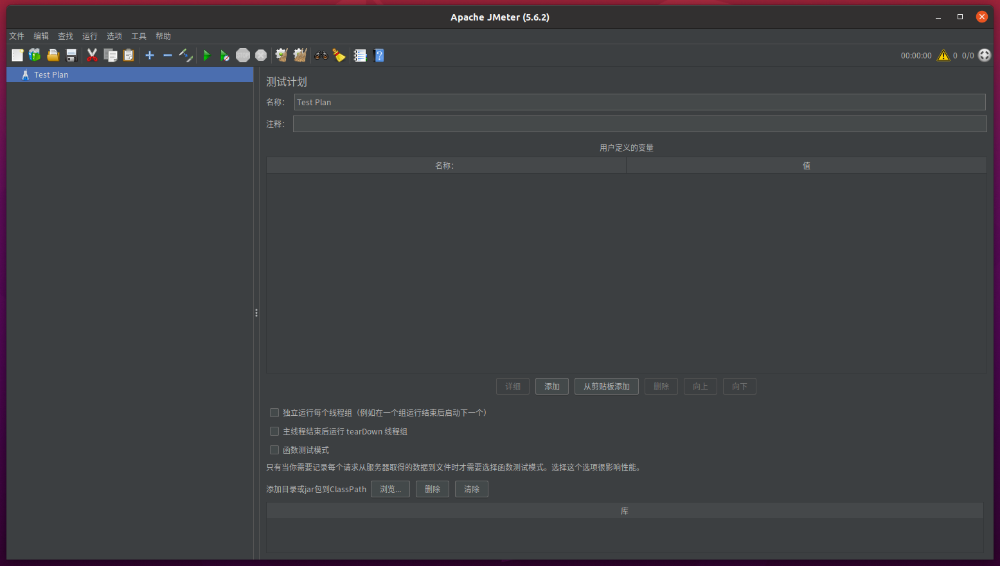

# ubuntu安装jmeter

## 1.安装

官网下载地址： https://jmeter.apache.org/download_jmeter.cgi

 官网文档地址：https://jmeter.apache.org/usermanual/index.html

中文文档地址： https://jmeter.xiniushu.com/get-started

```shell
#解压
yantao@ubuntu20:~/app$ tar -zxf apache-jmeter-5.6.2.tgz

#进入安装目录
yantao@ubuntu20:~/app$ cd apache-jmeter-5.6.2/

#查看文件
yantao@ubuntu20:~/app/apache-jmeter-5.6.2$ ll
总用量 80
drwxr-xr-x  9 yantao yantao  4096 11月 15 11:55 ./
drwxrwxr-x 13 yantao yantao  4096 11月 16 11:12 ../
drwxrwxr-x  2 yantao yantao  4096 11月 16 10:58 backups/
drwxr-xr-x  6 yantao yantao  4096 11月 16 10:17 bin/	#可执行程序文件目录
drwxr-xr-x  5 yantao yantao  4096 7月  11 20:28 docs/
drwxr-xr-x  2 yantao yantao  4096 4月  22  2023 extras/
drwxr-xr-x  4 yantao yantao 12288 6月  29 23:51 lib/	#库文件目录
-rw-r--r--  1 yantao yantao 17142 6月  29 23:55 LICENSE
drwxr-xr-x 68 yantao yantao  4096 6月  17 16:10 licenses/
-rw-r--r--  1 yantao yantao   167 6月  29 23:55 NOTICE
drwxr-xr-x  6 yantao yantao  4096 7月  11 20:28 printable_docs/
-rw-r--r--  1 yantao yantao 10756 6月  29 23:08 README.md

```

bin目录

```shell
yantao@ubuntu20:~/app/apache-jmeter-5.6.2/bin$ ll |grep jmeter
-rwxr-xr-x 1 yantao yantao  8644 5月   5  2023 jmeter*		#Linux系统下的启动程序
-rw-r--r-- 1 yantao yantao  8377 5月   5  2023 jmeter.bat	#Windows系统下的启动程序
-rw-rw-r-- 1 yantao yantao  1790 11月 16 11:21 jmeter.log
-rw-r--r-- 1 yantao yantao  1680 5月   5  2023 jmeter-n.cmd
-rw-r--r-- 1 yantao yantao  1683 5月   5  2023 jmeter-n-r.cmd
-rw-r--r-- 1 yantao yantao 57384 7月   4 17:41 jmeter.properties
-rwxr-xr-x 1 yantao yantao  1358 5月   5  2023 jmeter-server*
-rw-r--r-- 1 yantao yantao  2395 5月   5  2023 jmeter-server.bat
-rwxr-xr-x 1 yantao yantao  4155 5月   5  2023 jmeter.sh*	#Linux系统下的启动程序,可以添加额外的参数
-rw-r--r-- 1 yantao yantao  1575 5月   5  2023 jmeter-t.cmd
-rw-r--r-- 1 yantao yantao   986 5月   5  2023 jmeterw.cmd
```


## 2.启动

```shell
yantao@ubuntu20:~/app/apache-jmeter-5.6.2/bin$ ./jmeter
```


汉化



